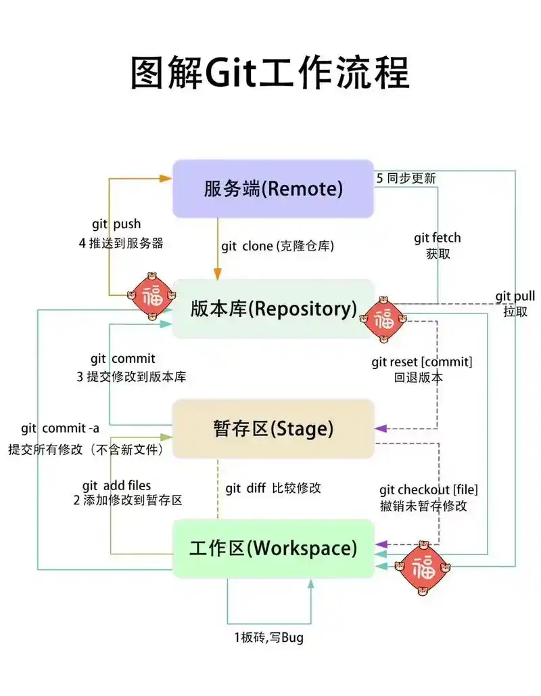
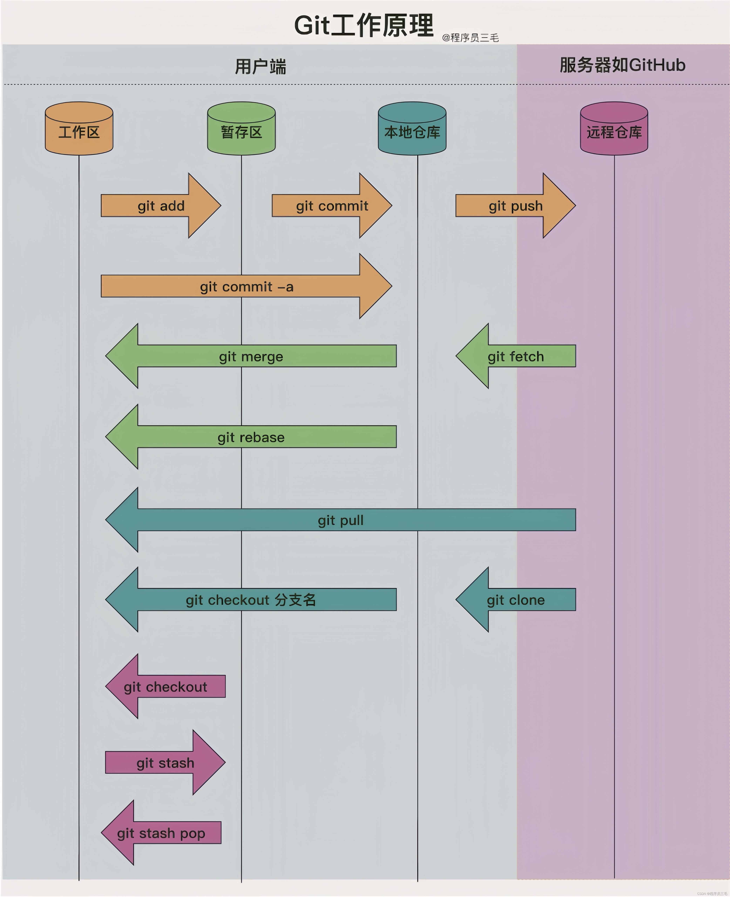

-
-
- 文件结构
	- 
	  id:: 6948ad3b-3f15-4616-a975-9c0cbe5d8859
	-
	-
- 高级操作
	- 
	  id:: 6948ad3b-9882-44dd-806b-638eba3509ab
	- [[local (git)]]:git的本地文件，本地git文件包含[[workspace]],[[stage]],[[stash]] local [[repository]], 使用[[git fetch]]会从服务器拉回远端分支XX并存在本地 [[repository]] 的副本origin/XX，本地操作是用origin/XX 类似的名字来引用，origin表示从服务器端拉过来的副本
	- [[workspace]]是本地工作文件夹
	- [[remote]] 是从服务器拉回来，存在本地的副本，名字一般叫origin/master之类。如果你在origin/master上commit，HEAD处于分离状态，也就是HEAD会移动到新的commit，但是该分支还停留在原地。所以你提交不会更改分支origin/master。git的意思是origin/master分支只反映服务器端的变化，本地不让直接改，你要改只能改自己的，然后push到服务器上去合并。你想改origin/master的指针，只能更改本地master分支，然后push到服务器上面，这样本地的origin/master也跟着改变了。
	- [[HEAD]] 可以指向git当前的工作区里的节点。如果是[[git checkout]] BranchName的，就是指向当前分支,可以作为当前分支别名，如果是[[git checkout]] Hashcode,就是指向某个节点。如果HEAD不是某分子的最新节点，就不要在上面提交。一般推荐在该节点新建分支以后再提交。 “*”指示当前分支，[[HEAD]]指示当前节点。两者可以不同。
	- [[^]]当前节点的上一个节点如 master^^表示当前节点前两个节点,[[~]]4 表示 4个^。如果当前节点由两个branch merge而来，^1, ^2表示不同的祖先branch，两种符号可以连写 HEAD^2~3^2
	- [[node]]:node由hash值指定的commit。node之间有指针指向它的前辈，这个指针构成一个链表。在node上操作时，分支指针留在原地。
	- [[branch]]: 每个分支就是一个指针指向该分支最后一个node。在分支上操作时，如果产生新节点，分支指针会指向最新节点
	-
	-
	-
-